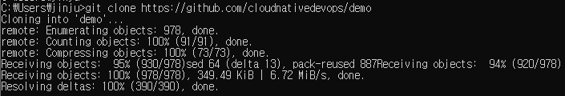

## 2.1 첫번째 컨테이너 시작하기
- Window 10 pro에 도커 데스크톱 설치  
-> 설치 후에, CMD창에서 docker version 확인
- 컨테이너 이미지란?  
압축파일과 같다고 생각하면 됨. 바이너리 파일. 고유 ID를 가지며 컨테이너를 실행하는 데 필요한 모든 것을 담고 있음.  
컨테이너를 도커로 직접 실행하든지 쿠버네티스 클러스터에서 실행하든지 컨테이너 이미지에 ID나 URL을 지정해야 함.  
Ex) 컨테이너 이미지 이해 돕고자 데모 애플리케이션, 깃허브 저장소에서 데모 파일 다운로드한 뒤 다음 명령어 실행  
먼저 Git for Window 설치 (64-bit)  
[https://git-scm.com/download/win](https://git-scm.com/download/win)  
→ 설치 후에 git CMD 실행  
https://github.com/cloudnativedevops/demo  
#git clone https://github.com/cloudnativedevops/demo
  

#docker container run -p 9999:8888 —name hello cloudnatived/demo:hello  
.png)  

명령어를 실행 중인 상태로 유지하고 브라우저에서 http://localhost:9999/에 접속   
.png)  
