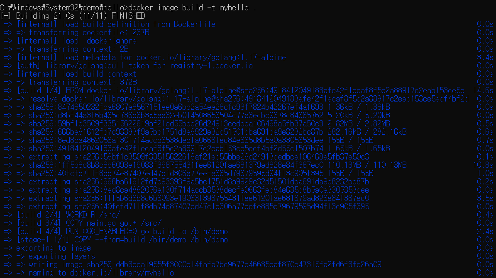
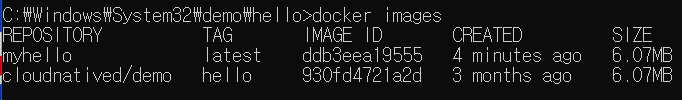
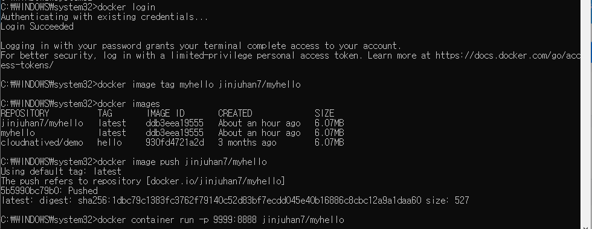
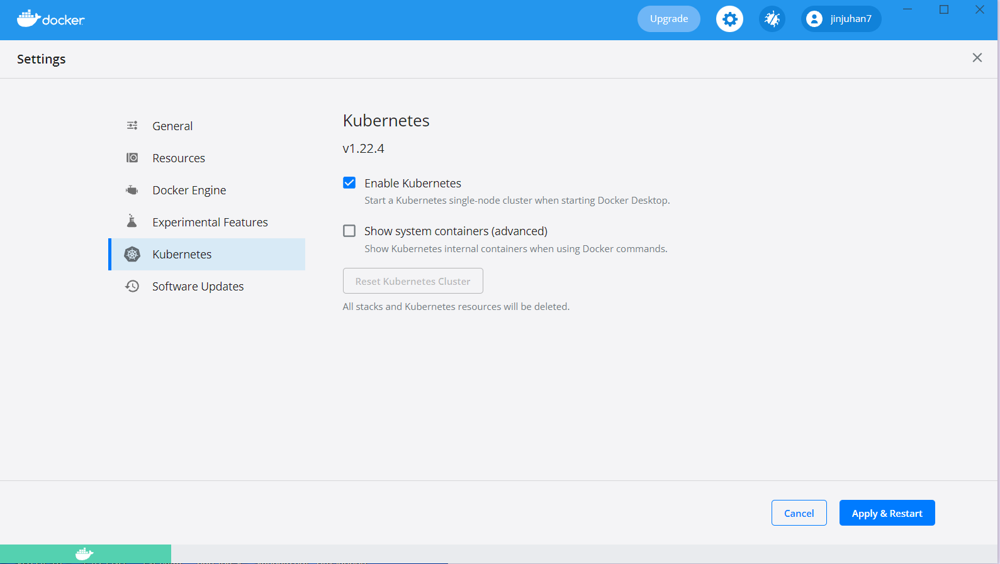
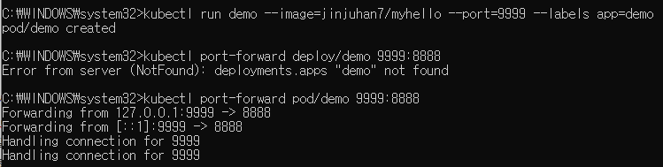
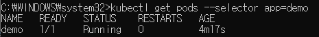

## 첫번째 컨테이너 시작하기
- Window 10 pro에 도커 데스크톱 설치  
-> 설치 후에, CMD창에서 docker version 확인
- 컨테이너 이미지란?  
압축파일과 같다고 생각하면 됨. 바이너리 파일. 고유 ID를 가지며 컨테이너를 실행하는 데 필요한 모든 것을 담고 있음.  
컨테이너를 도커로 직접 실행하든지 쿠버네티스 클러스터에서 실행하든지 컨테이너 이미지에 ID나 URL을 지정해야 함.  
Ex) 컨테이너 이미지 이해 돕고자 데모 애플리케이션, 깃허브 저장소에서 데모 파일 다운로드한 뒤 다음 명령어 실행  
먼저 Git for Window 설치 (64-bit)  
[https://git-scm.com/download/win](https://git-scm.com/download/win)  
→ 설치 후에 git CMD 실행  
https://github.com/cloudnativedevops/demo  
#git clone https://github.com/cloudnativedevops/demo
  
#docker container run -p 9999:8888 —name hello cloudnatived/demo:hello  
.png)  
명령어를 실행 중인 상태로 유지하고 브라우저에서 http://localhost:9999/에 접속   
.png)  
창닫아서 컨테이너 종료  
#docker images  
#docker ps -a
.png)  
#docker rm 149d0376fe85  
#docker ps -a (컨테이너 없어짐)  

## 컨테이너 빌드하기  
컨테이너 이미지 빌드는 docker image build 명령어를 사용한다.  
Dockerfile이란 특별한 텍스트 파일을 입력으로 받는다. 도커파일은 컨테이너 이미지가 포함할 것을 구체적으로 지정한다.  
컨테이너 이미지는 도커파일 내에 정의된다. 도커파일은 컨테이너를 빌드하는 명령어가 들어있는 텍스트 파일이다.  
컨테이너의 장점은 기존 이미지를 기반으로 새로운 이미지를 빌드할 수 있다는 것이다. 예를들어 우분투 운영체제가 포함된 컨테이너 이미지를 가져와서 원하는 파일을 추가하면 새로운 이미지가 생성된다.  
일반적으로 도커파일은 베이스 이미지라고 부르는 시작 이미지를 가져와 변환하여 새로운 이미지로 저장하는 명령을 담고 있다.  
- 빌드 단계가  필요한 이유?  
→  프로그램을 실행하기 위해 필요한 것은 데모 바이너리 파일이므로 도커 파일은 새로운 스크래치 컨테이너를 만들고, 그 안에 바이너리 파일을 집어넣는다.  

최종 이미지 파일은 약 6MiB로 매우 작다. 상용 환경에 배포하기 충분한 이미지 크기.  
빌드 단계가 없다면 최종 컨테이너 이미지는 약 350MiB, 그중 98%는 불필요하며 결코 사용되지 않을 공간.  
컨테이너 이미지 크기가 작을수록 업로드와 다운로드 속도가 빨라지며 실행 속도도 빠르다.  
또한 최소 컨테이너는 보안 문제를 일으킬 수 있는 attack surface을 줄여준다.   
Go는 컴파일된 언어이므로 독립적인 실행 파일을 생성할 수 있어서 최소 컨테이너(스크래치)를 작성하는데 이상적이다.  

Ex) hello 폴더에서 다음 명령어 실행  
#docker image build -t myhello .  
도커 이미지 생성시 인수 -t를 사용하면 편한 이름을 지정할 수 있다.  
.png)  
#docker images  
  
-> 컨테이너 빌드에 성공함.  
컨테이너는 네트워크 포트와 같은 리소스에 직접 접근할 수 없다.  
#docker container run -p 9999:8888 —name hello cloudnatived/demo:hello  
#docker container run -p HOST_PORT:CONTAINER_PORT ...  
여기서 데모 애플리케이션은 8888번 포트로 연결을 수신하지만 이 포트는 컨테이너 내부의 8888번 사설 포트이며 호스트 컴퓨터 포트가 아니다.  
컨테이너의 8888번 포트로 연결하려면 호스트 컴퓨터의 포트를 컨테이너 해당 포트로 전달(forward)해야 한다. 8888번을 포함하여 어떤 포트든 지정할 수 있다.  
여기서는 호스트 컴퓨터 포트와 컨테이너 포트를 구별하고자 9999번 포트를 사용한다. 도커에 호스트 포트를 전달하려면 인수에 -p를 사용한다.  
컨테이너가 실행되면 호스트 컴퓨터의 HOST_PORT 포트에 대한 모든 요청은 컨테이너의 CONTAINER_PORT 포트로 자동 전달된다.   
이것이 브라우저로 애플리케이션을 연결하는 방법이다.

## 컨테이너 레지스트리
로컬 이미지를 빌드하고 실행만 해도 도커를 완벽하게 사용할 수 있지만,
컨테이너 레지스트리에서 이미지를 푸시하고 풀할 수 있다면 훨씬 더 유용하다.
레지스트리를 사용하면 고유한 이름(예: cloudnatived/demo:hello)을 지정하여 이미지를 저장하고 가져올 수 있다.
docker container run 명령의 기본 레지스트리는 도커 허브(Docker Hub)이지만 다른 레지스트리를 사용하거나 직접 레지스트리를 구축할 수도 있다.
도커 허브에서는 공개된 컨테이너 이미지를 자유롭게 다운로드하고 사용할 수 있지만 이미지를 업로드하려면 도커 ID라는 계정이 필요하다. 
도커 허브 웹페이지(http://hub.docker.com)를 참고해 도커 ID로 로그인 하자.
  
- 레지스트리 인증하기
#docker login  
로컬 이미지를 레지스트리에 푸시하려면 YOUR_DOCKER_ID/myhello 형식으로 이름을 지정해야한다. (이름을 지정하고자 이미지를 다시 빌드하지 않아도 됨, 다음 명령 실행)  
#docker image tag myhello jinjuhan7/myhello  
이렇게 하면 이미지를 레지스트리에 푸시할 때 도커가 이미지를 저장할 계정을 알 수 있다.  
다음 명령어를 사용하여 이미지를 도커 허브로 푸시하자.  
#docker image push jinjuhan7/myhello  
이제 인터넷 접속이 가능한 어디에서나 컨테이너 이미지를 실행할 수 있다.  
#docker container run -p 9999:8888 jinjuhan7/myhello  
  

## 헬로, 쿠버네티스
첫 번째 컨테이너 이미지를 빌드하고 푸시했고 docker container run 명령어로 컨테이너를 실행할 수 있지만 아직 재미있는 것이 더 많다.  
쿠버네티스를 활용해 조금 더 모험적인 것을 시도해보자.  
쿠버네티스 클러스터를 설치하는 방법은 여러 가지다.  
도커 데스크톱에는 쿠버네티스 지원이 포함되어있다. 도커 데스크톱 환경 설정을 열어 쿠버네티스를 활성화한다. (Apply & Restart → Install)  
쿠버네티스를 설치하고 시작하는 데 몇 분 정도 걸린다. 작업이 완료되면 데모 애플리케이션을 실행할 수 있다.  
  
 - 데모 애플리케이션 실행하기  
앞서 빌드했던 데모 이미지를 다시 실행한다.  
kubectl은 쿠버네티스 클러스터와 통신하는 기본 도구다. (명령어 형태 or YAML 형태로 사용)  
#kubectl run demo —image=jinjuhan7/myhelo —port=9999 —labels app=demo  
docker container run과 같은 역할을 하는 쿠버네티스 명령어다. 아직 이미지를 직접 빌드하지 않았다면 이 책에서 제공하는 —image=cloudnatived/demo:hello를 사용해도 된다.  
웹 브라우저와의 접속을 위해 로컬 시스템의 9999번 포트를 컨테이너의 8888번 포트로 전달한다.  
#kubectl port-forward pod/demo 9999:8888  
  
이 명령을 실행 상태로 유지하고 새 터미널을 열어 계속 진행한다.  
웹 브라우저로 http://localhost:9999에 접속하여 Hello, ~ 메시지를 확인한다.  
컨테이너가 실행되고 애플리케이션이 사용 가능한 상태가 되기까지 몇 초가 걸릴 수 있다. 30초 정도 지나도 준비 상태가 되지 않는다면 다음 명령어를 실행해본다.  
#kubectl get pods —selector app=demo
  
컨테이너가 실행 중일 때 브라우저로 접속한다면 터미널에서 Handling connecting for 9999 메시지를 확인할 수 있다.  
컨테이너가 실행되지 않을 경우, 만약 STATUS가 Running으로 표시되지 않는다면 문제가 있을 수 있다.  
예를 들어 상태가 ErrImagePull 혹은 ImagePullBackOff라면, 쿠버네티스가 지정한 이미지를 찾아서 다운로드 할 수 없음을 의미한다.  
이미지 이름을 잘못 입력했을 가능성도 있으니 kubectl run 명령어를 다시 한번 확인해보자.  
ContainerCreating가 표시된다면 양호한 상태다. 쿠버네티스가 이미지를 다운로드하고 나서 이미지를 실행할 것이다.  
잠시 기다렸다가 확인해보자.  

## Minikube  
도커 데스크톱 내 쿠버네티스 지원을 사용할 수 없거나, 사용하길 원하지 않는 경우 대안으로 사랑받는 Minikube가 있다.  
도커 데스크옵과 유사하게 컴퓨터에서 실행되는 단일 노드 쿠버네티스 클러스터를 제공한다(실제로는 가상 머신에서 실행되지만 크게 중요하지 않다).  
2장은 컨테이너 빌드 및 실행에 익숙해지는 계기!  

- 모든 소스 코드 예제는 [https://github.com/cloudnativedevops/demo 에](https://github.com/cloudnativedevops/demo에서)서 확인할 수 있다.
